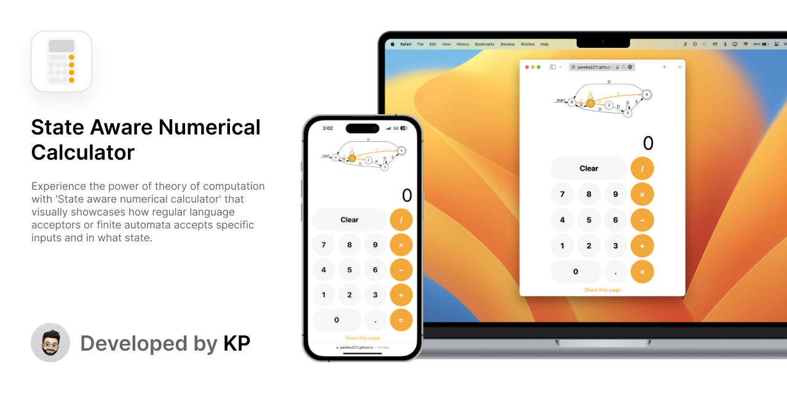

# State aware numerical calculator

The "State aware numerical calculator" is a calculator that goes beyond basic arithmetic operations. It visually showcases how regular language acceptors or finite automata accepts specific inputs and in what state. The calculator was developed as part of an innovative assignment in the "Theory of Computation" course.

## Features

-   Visualizes the different states of the automata
-   Guides users on what inputs they can give until a valid input is given, in case the automata enters a dead state
-   Uses DOPE symbols (digits, operators, period, and equal) to help users understand the concept of theory of computation in an engaging way

## Getting started

To use the calculator, simply open the [HTML file](./index.html) in your web browser. You can input numbers and operators as you would with a regular calculator. The visualizations of the automata states will be displayed on the screen.

## Contributing

If you're interested in contributing to the project, feel free to create a pull request or open an issue on the GitHub repository. All contributions and feedback are welcome!

## License

This project is licensed under the [MIT License](./LICENSE).
